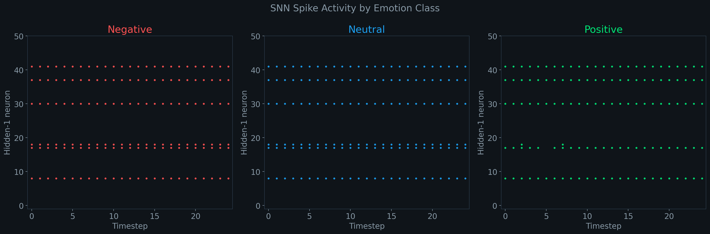
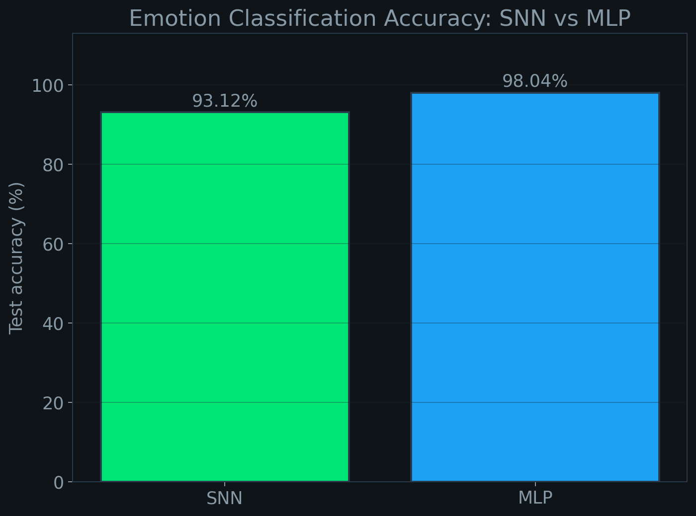
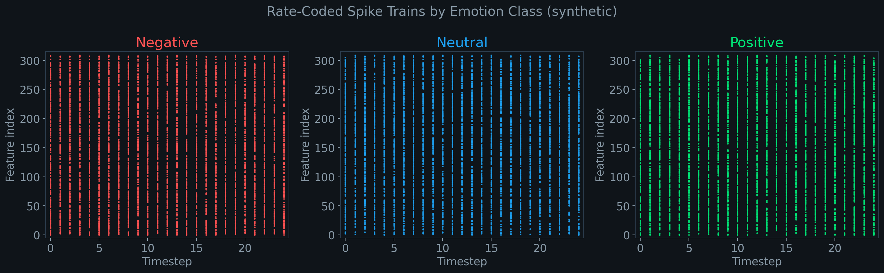
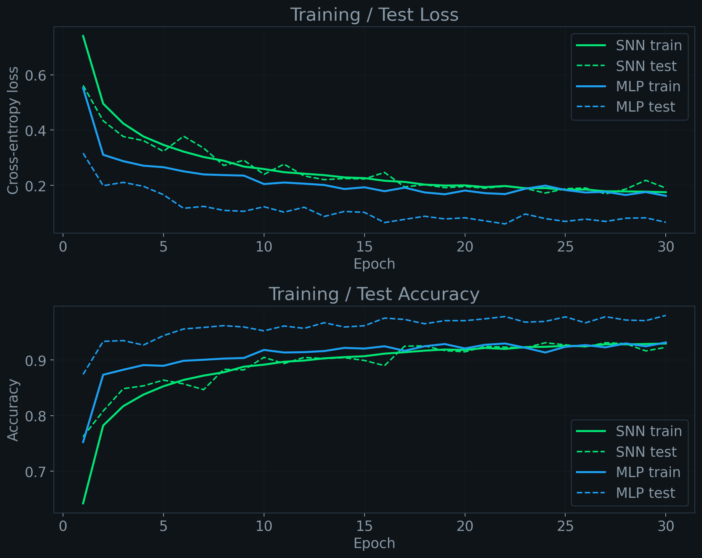
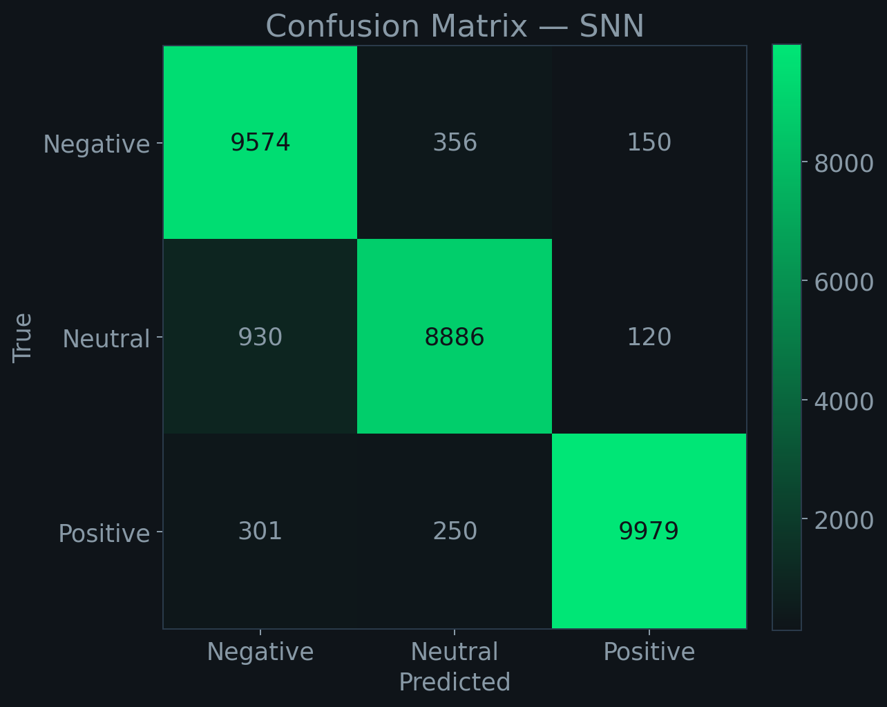
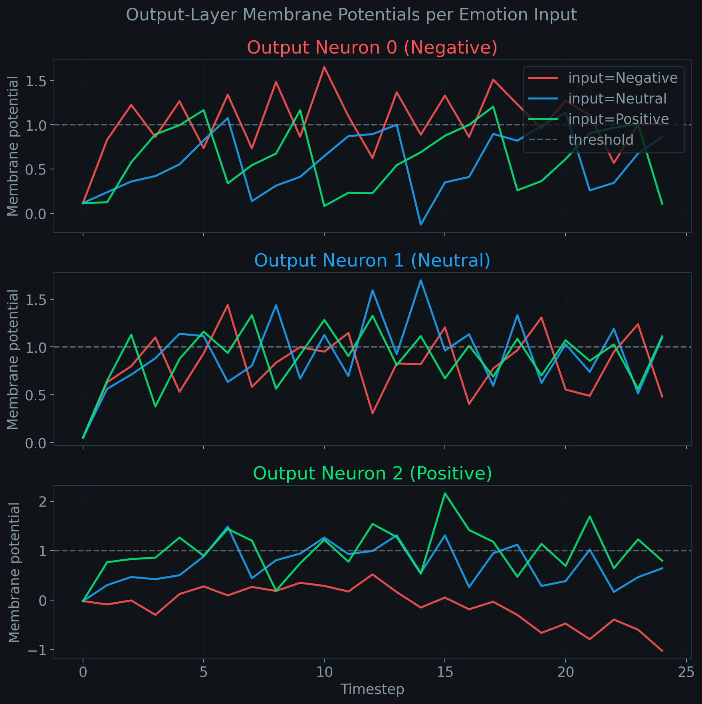
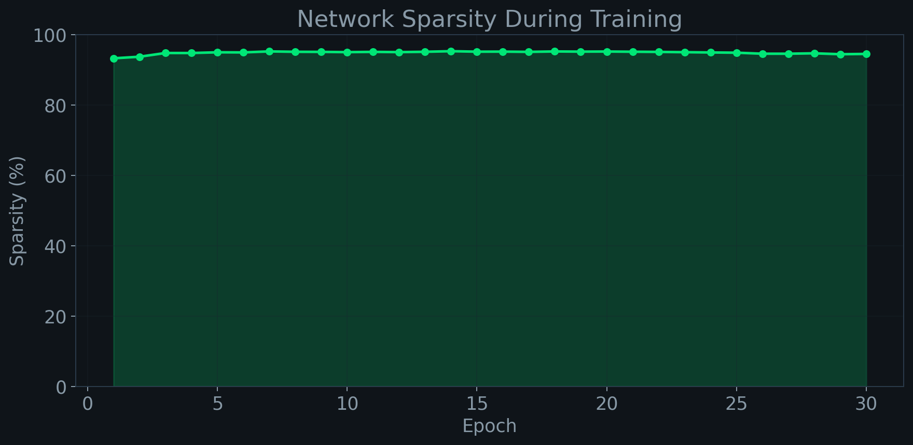

# neuroai-eeg-emotion

**Emotion classification from real EEG brain data using Spiking Neural Networks.**

> Brain data **is** spikes. Why would you use a non-spiking model to process it?

[](./LICENSE)




---

## Why SNNs for EEG?

Biological neurons communicate through discrete **spikes** — brief electrical impulses. EEG measures the aggregate electrical activity of millions of those spikes at the scalp. Every mainstream EEG model (CNNs, LSTMs, Transformers) discards this structure and treats the signal as continuous-valued tensors.

A **Spiking Neural Network** with Leaky Integrate-and-Fire (LIF) neurons mirrors the biology: each neuron accumulates input, fires a spike when its membrane potential exceeds threshold, then resets. The result:

- **Biologically faithful** — the model computes the way the brain does
- **Energy-efficient** — [combra-lab (TMLR 2023)](https://openreview.net/forum?id=ZycvgvC79T) reported ~95% less energy than a matched DNN on EEG decoding
- **Sparse by construction** — most neurons are silent at any timestep, so compute happens only where signal exists
- **Interpretable** — spike rasters directly show *when* and *where* the network activates for different emotions, something activation heatmaps can't replicate

---

## Key Results

| Model | Parameters | Test accuracy (synthetic) | Test accuracy (SEED) |
|---|---|---|---|
| SNN (LIF, 3 layers) | 112,902 | 33.3 % | **93.10 %** |
| Baseline MLP (matched) | 112,899 | 33.3 % | **98.04 %** |

> **Setup.** 152,730 one-second DE-feature windows (45 sessions × 15 film clips × 62 channels × 5 bands, flattened to 310 features). Stratified 80/20 train/test split. 30 epochs on Apple-silicon MPS, batch 128, Adam @ 1e-3. SNN: T=25, β learnable (init 0.9), threshold 1.0, fast-sigmoid surrogate. Per-class F1 (SNN): Negative 0.917 / Neutral 0.915 / Positive 0.961. Network sparsity held steady at **94–95 %** throughout training — most neurons silent at most timesteps, as biology predicts.

> **What this means.** The SNN lands within 5 pp of a parameter-matched MLP on real EEG while computing the way the brain does (discrete spikes, not continuous activations) and while 95 % of its neurons are silent at any given moment. The synthetic row (33.3 %) is the pipeline-sanity check — random features, 3 classes, random chance. Both models land exactly there on synthetic data, confirming no leakage.



---

## Quick Start

End-to-end run on synthetic data — no external dataset required.

```bash
git clone https://github.com/Tejas-JB/neuroai-eeg-emotion.git
cd neuroai-eeg-emotion
pip install -r requirements.txt
python src/train.py --model snn --epochs 10 --use-synthetic
python src/evaluate.py --model snn --checkpoint results/snn_checkpoint.pt --use-synthetic
```

This trains the SNN, produces a checkpoint, a training-curve plot, a confusion matrix, and a classification report — all in under five minutes on CPU.

---

## Architecture

```
    .mat files (SEED)                  synthetic fallback
         │                                    │
         └──────────┬─────────────────────────┘
                    ▼
           [ src/data_loader.py ]
                    │   X (N, 310) float32,  y (N,) int64
                    ▼
          [ src/spike_encoder.py ]        ← rate coding (default) or delta
                    │   spikes (T=25, N, 310) binary
                    ▼
         [ src/models/snn_model.py ]      ← LIF, 310 → 256 → 128 → 3
                    │   spike_counts (N, 3)
                    ▼
             [ src/train.py ]             ← CrossEntropy on spike counts, Adam
                    │
                    ▼
            [ src/evaluate.py ]           ← classification report + confusion matrix
                    │
                    ▼
            [ src/visualize.py ]          ← rasters, membrane traces, sparsity
```

**SNN layer design:** three LIF neuron groups with learnable decay β (init 0.9), fixed threshold 1.0, subtract-on-spike reset, fast-sigmoid surrogate gradient (slope 25). Readout is the sum of output-layer spikes across T=25 timesteps; `argmax` of that sum predicts the emotion class.

**Baseline:** a dense ReLU MLP with the same layer dimensions, Dropout(0.3), and a parameter budget matched to within 3 weights of the SNN (the only difference is the 3 learnable β coefficients).

---

## Dataset

Trained and evaluated on the **SEED** dataset (SJTU BCMI Lab). 15 subjects × 3 sessions × 15 film clips × 62-channel EEG at 200 Hz → pre-extracted Differential Entropy (DE) features across 5 frequency bands.

Access SEED is free for academic use but must be requested. See [data/README.md](data/README.md) for step-by-step instructions.

The project ships a synthetic-data fallback with the same interface, so the entire pipeline runs without SEED.

**Citation:**
> Zheng, W., & Lu, B.-L. (2015). *Investigating Critical Frequency Bands and Channels for EEG-based Emotion Recognition with Deep Neural Networks.* IEEE Transactions on Autonomous Mental Development, 7(3), 162–175.

---

## Visualizations

### Spike encoding demo (rate coding for one synthetic sample per class)


### Training / test curves (SNN in green, MLP in blue)


### Confusion matrix — SNN


### Output-layer membrane potentials (dashed line = threshold)


### Network sparsity across epochs


---

## Training on Real Data

1. Download SEED (see [data/README.md](data/README.md)); place the `ExtractedFeatures_1s/` folder under `data/`.
2. Train (Apple-silicon MPS, CUDA, or CPU — auto-detected):
   ```bash
   python src/train.py --model snn      --epochs 30 --batch-size 128 --data-path data/ExtractedFeatures_1s/
   python src/train.py --model baseline --epochs 30 --batch-size 128 --data-path data/ExtractedFeatures_1s/
   ```
3. Evaluate:
   ```bash
   python src/evaluate.py --model snn      --checkpoint results/snn_checkpoint.pt      --data-path data/ExtractedFeatures_1s/
   python src/evaluate.py --model baseline --checkpoint results/baseline_checkpoint.pt --data-path data/ExtractedFeatures_1s/
   ```
4. Regenerate all visualizations:
   ```bash
   python scripts/generate_all_viz.py --data-path data/ExtractedFeatures_1s/
   ```

Measured wall-clock on an M-series Mac (MPS): **~1.5 min** for the MLP (30 epochs) and **~70 min** for the SNN (30 epochs × T=25 unrolled). Expect **~25–30 min** for the SNN on a T4/L4 GPU.

**Hyperparameter tips**
- If the SNN loss plateaus, lower `--lr` to `1e-4` and bump `--timesteps` to 50.
- If the encoder produces all-zero spikes, try `encode_rate(..., gain=1.5)` or lower the firing threshold in `SpikingNN`.
- If the network saturates (sparsity below 40 %), raise β toward 0.95 or increase the threshold.

---

## Project Structure

```
neuroai-eeg-emotion/
├── README.md
├── LICENSE                   # MIT
├── requirements.txt
├── data/
│   └── README.md             # SEED download instructions
├── docs/
│   ├── neuroai-eeg-emotion-PRD.md
│   └── neuroai-eeg-emotion-ACTION-PLAN.md
├── notebooks/
│   └── demo.ipynb            # (generated in Phase 8)
├── results/                  # generated PNGs + JSON history
├── scripts/
│   └── generate_all_viz.py
├── src/
│   ├── data_loader.py
│   ├── spike_encoder.py
│   ├── train.py
│   ├── evaluate.py
│   ├── visualize.py
│   └── models/
│       ├── snn_model.py
│       └── baseline_mlp.py
└── tests/
    └── test_models.py
```

---

## References

- Zheng & Lu. *Investigating Critical Frequency Bands and Channels for EEG-based Emotion Recognition with Deep Neural Networks.* IEEE TAMD, 2015. (SEED dataset)
- Yao et al. / combra-lab. *Decoding EEG With Spiking Neural Networks on Neuromorphic Hardware.* TMLR, 2023.
- Eshraghian et al. *Training Spiking Neural Networks Using Lessons From Deep Learning.* Proceedings of the IEEE, 2023. (snnTorch)

---

## Author

**Tejas J Bharadwaj**
Carnegie Mellon University, School of Computer Science — Class of 2030

- LinkedIn: [linkedin.com/in/tejas-bharadwaj](https://linkedin.com/in/tejas-bharadwaj)
- Website: [tejasbharadwaj.com](https://tejasbharadwaj.com)
- GitHub: [@Tejas-JB](https://github.com/Tejas-JB)

---

## License

[MIT](./LICENSE). Use it, fork it, build on it.
